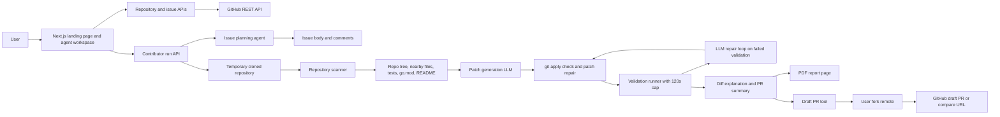

# Go Rabbit

Go Rabbit is an agentic AI contributor assistant for focused open-source Go issues.

It helps a user select an approved repository, fetch open GitHub issues, clone a temporary workspace, scan the codebase, generate a patch, validate it, produce a PR summary, and optionally push a draft PR or open a manual compare URL.

Hosted app: https://go-rabbit-sable.vercel.app

## What It Does

- Fetches open issues from approved Go repositories.
- Blocks risky or non-actionable issues by default.
- Clones a local run workspace into the system temp directory.
- Scans repository files, tests, `go.mod`, README, issue keywords, issue comments, and a compact repository tree.
- Sends richer context to the patch agent so it can avoid shallow README/changelog-only patches for real code bugs.
- Generates a focused unified diff.
- Applies patches through `git apply --check` before touching files.
- Runs validation with live terminal-style logs.
- Skips long validation commands after 2 minutes and continues with an explicit risk note.
- Retries failed validation with full error logs sent back to the LLM.
- Generates a clean PR summary.
- Creates a draft PR when GitHub auth allows it.
- Falls back to a manual GitHub compare URL if PR GraphQL creation is blocked.
- Exports a clean report through the browser's Save as PDF flow.

## Approved Repositories

The backend only allows these repositories by default:

- `gin-gonic/gin`
- `spf13/cobra`
- `go-playground/validator`
- `golangci/golangci-lint`

Repository selection is validated server-side before any clone or agent run.

## Tech Stack

- Next.js App Router
- TypeScript
- OpenAI-compatible chat clients
- Azure OpenAI for GPT models
- GitHub REST API
- GitHub CLI for fork, push, and PR creation
- Zod for request and output validation
- Husky pre-commit checks

## Project Structure

```text
src/
  app/
    _components/
      RunSetupForm.tsx
    api/v1/
      __agents__/
      __prompts__/
      __tools__/
      runs/
      issues/
      repositories/
    globals.css
    icon.svg
    layout.tsx
    page.tsx
  config/
  fetchers/
  utils/
```

## Main Flow

1. Select an approved repository.
2. Fetch open issues from GitHub.
3. Select an issue by title.
4. Run the contributor agent.
5. Agent fetches issue details and comments.
6. Agent classifies difficulty.
7. Agent clones the repository into a temp workspace.
8. Agent scans code, tests, config files, and project tree.
9. Agent generates a fix plan.
10. Agent generates a focused patch.
11. Patch is checked with `git apply --check`.
12. Patch is applied locally.
13. Validation runs with streamed logs.
14. If validation fails, logs are sent to the LLM for repair.
15. If validation exceeds 2 minutes, it is marked `SKIP`.
16. Agent explains the diff.
17. Agent creates a PR summary.
18. User can open a draft PR or use the manual compare URL.
19. User can download a PDF-style report through browser print.

## Architecture



The app is intentionally split between a small UI surface and server-side tools. The browser only selects repositories, issues, and user actions. The API routes own GitHub reads, temporary repository workspaces, model calls, validation commands, PR creation, and report generation.

## Environment Variables

Create `.env.local` with the values your deployment needs:

```bash
cp .env.example .env.local
```

Then fill in:

```bash
GITHUB_TOKEN=

AZURE_OPENAI_API_KEY=
AZURE_OPENAI_ENDPOINT=
AZURE_OPENAI_API_KEY_EAST_US=
AZURE_OPENAI_ENDPOINT_EAST_US=
AZURE_OPENAI_API_KEY_SWEDEN=
AZURE_OPENAI_ENDPOINT_SWEDEN=

GEMINI_API_KEY_MB_AI=
```

The active model/client routing lives in `src/fetchers/ai-client.ts` and model constants live in `src/config/llm.ts`.

## Run Locally In Four Steps

1. Install dependencies from the project root:

```bash
npm install
```

2. Create the local environment file:

```bash
cp .env.example .env.local
```

Fill `.env.local` with at least `GITHUB_TOKEN` and the model credentials used by your selected model provider.

3. Authenticate GitHub CLI for fork, push, and PR creation. Use the same GitHub account that owns the token or the target fork:

```bash
gh auth login
```

4. Start the Next.js app:

```bash
npm run dev
```

Open the printed local URL, usually `http://localhost:3000`, and run the workflow from the Agent Workspace section.

## GitHub Token Notes

`GITHUB_TOKEN` is used for fetching issues and comments.

For fork and PR creation, GitHub has important restrictions:

- Fine-grained personal access tokens may fail with `HTTP 403: Resource not accessible by personal access token` when creating forks.
- A classic PAT with `repo` scope is the most reliable token for automated fork/PR flows.
- If fork creation fails, create the fork once manually:

```bash
gh repo fork golangci/golangci-lint --clone=false
```

Then retry `Open Draft PR`.

If authentication is confused, re-authenticate GitHub CLI:

```bash
gh auth logout
gh auth login
```

## PR Creation Behavior

The PR tool:

1. Checks GitHub CLI auth.
2. Commits any local run changes.
3. Ensures `go-rabbit-fork` points to the authenticated account's fork.
4. Pushes the `go-rabbit/issue-{number}` branch.
5. If the remote branch already exists, retries with `--force-with-lease` only for `go-rabbit/*` branches.
6. Runs `gh pr create --draft`.
7. If GraphQL PR creation is blocked, returns a GitHub compare URL for manual PR creation.

## Validation Behavior

Validation commands are selected during repository scan.

Current behavior:

- Runs commands sequentially.
- Streams useful output to the terminal panel.
- Emits heartbeat logs while commands are running.
- Times out each command after 120 seconds.
- Marks timed-out commands as `SKIP`.
- Does not retry patch generation after a validation timeout.
- Sends full failed validation logs to the LLM on non-timeout failures.

## PDF Report

After a run produces a PR summary, click `Download PDF Report`.

The app opens a clean report page and triggers the browser print dialog. Choose `Save as PDF`.

A checked-in sample report is available in the landing page preview and directly at:

```text
/reports/gosec-g602-go-rabbit-report.pdf
```

The report includes:

- Issue and repository metadata
- PR summary
- Changed files
- Validation status
- Diff explanation
- Patch rationale
- Agent terminal trace
- Raw diff appendix

## Local Development Commands

Install dependencies:

```bash
npm install
```

Run the app:

```bash
npm run dev
```

Run checks:

```bash
npm run lint
npm run typecheck
npm run build
```

Run the full pre-commit check:

```bash
npm run precommit
```

## Pre-Commit

Husky is configured through:

```bash
npm run prepare
```

The pre-commit workflow should run:

```bash
npm run precommit
```

## Safety Boundaries

- Arbitrary repositories are blocked.
- Large, risky, security-sensitive, architecture-heavy, or spam issues are blocked by default.
- Patches must be valid unified diffs.
- Patches are checked with `git apply --check`.
- Run workspaces are created under the OS temp directory, not inside the app repo.
- PR creation only happens after explicit user action.

## Current Limitations

- Generated fixes depend on the quality of issue context and local repository scan.
- Broad Go validation can be slow; commands are capped at 2 minutes.
- GitHub fork/PR automation depends on token and `gh` permissions.
- Some repositories require maintainer-specific decisions that the agent should not infer.
